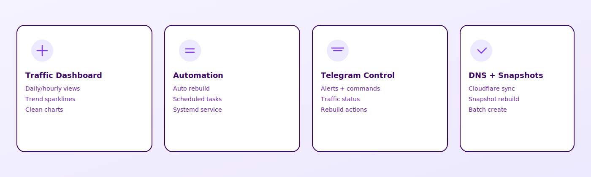
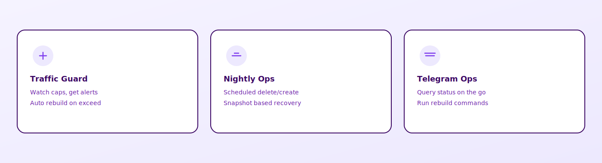

[English](README.md) | [中文](README.zh.md)

[](LICENSE)
[](#quick-start)

A lightweight Hetzner traffic dashboard + automation monitor. Includes a web UI, Telegram alerts/commands, auto rebuilds, and DNS checks.

---

<table>
  <tr>
    <td width="60%" valign="top">
      <strong>Start here</strong><br />
      One command installs Web + automation + Telegram support.<br /><br />
      <code>curl -fsSL https://raw.githubusercontent.com/liuweiqiang0523/Hetzner-Web/main/scripts/install-all.sh | sudo bash</code>
    </td>
    <td width="40%" valign="top">
      <strong>Next step</strong><br />
      Fill configs and restart services.<br /><br />
      <code>config.yaml</code> · <code>web_config.json</code> · <code>automation/config.yaml</code>
    </td>
  </tr>
</table>

---

## Table of Contents

- [Quick Start](#quick-start)
- [Screenshots](#screenshots)
- [Highlights](#highlights)
- [Use Cases](#use-cases)
- [Install Options](#install-options)
- [Prerequisites](#prerequisites)
- [Config Setup](#config-setup)
- [Telegram Setup](#telegram-setup)
- [Config File Locations](#config-file-locations)
- [Troubleshooting](#troubleshooting)
- [Project Layout](#project-layout)
- [Features](#features)
- [Security Notes](#security-notes)

---

<a id="quick-start"></a>
##  Quick Start

If this is your first time, use the all-in-one script to install Web + automation + Telegram support in one go.

```bash
curl -fsSL https://raw.githubusercontent.com/liuweiqiang0523/Hetzner-Web/main/scripts/install-all.sh | sudo bash
```

Then continue with **Config Setup** below.


---

<a id="screenshots"></a>
##  Screenshots


---

<a id="highlights"></a>
##  Highlights



---

<a id="use-cases"></a>
##  Use Cases



---

<a id="install-options"></a>
##  Install Options

- All-in-one (recommended): `scripts/install-all.sh`
- Web-only: `scripts/install-docker.sh`
- Automation-only: `automation/install_hetzner_monitor.sh`

Existing deployments are safe by default. The all-in-one script exits if the install dir exists. If you really want to update an existing install:

```bash
curl -fsSL https://raw.githubusercontent.com/liuweiqiang0523/Hetzner-Web/main/scripts/install-all.sh | sudo ALLOW_UPDATE=1 bash
```

---

<a id="prerequisites"></a>
##  Prerequisites

Make sure these commands exist:

```bash
git --version
python3 --version
docker --version
docker compose version
systemctl --version
```

If any are missing, install them first (Ubuntu/Debian: `apt`).

---

<a id="config-setup"></a>
##  Config Setup

**Web config**
- `config.yaml`: set `hetzner.api_token`
- `web_config.json`: set `username` / `password`

**Automation config**
- `automation/config.yaml`: set Hetzner/Telegram/Cloudflare if needed

Apply changes:

```bash
cd /opt/hetzner-web

docker compose up -d --build
sudo systemctl restart hetzner-monitor.service
```

Open: `http://<your-server-ip>:1227`

---

<a id="telegram-setup"></a>
##  Telegram Setup

In `automation/config.yaml`:

```yaml
telegram:
  enabled: true
  bot_token: "YOUR_BOT_TOKEN"
  chat_id: "YOUR_CHAT_ID"
```

Then restart automation:

```bash
sudo systemctl restart hetzner-monitor.service
```

---

<a id="config-file-locations"></a>
##  Config File Locations


- Web: `/opt/hetzner-web/config.yaml`
- Web login: `/opt/hetzner-web/web_config.json`
- Automation: `/opt/hetzner-web/automation/config.yaml`

---

<a id="troubleshooting"></a>
##  Troubleshooting


Quick checks:
- `docker ps`
- `sudo systemctl status hetzner-monitor.service`
- `sudo journalctl -u hetzner-monitor.service -n 50 --no-pager`

---

<a id="project-layout"></a>
##  Project Layout

- Web dashboard (this directory): FastAPI + Vue, Docker-first
- Automation monitor: `automation/` (CLI/systemd service)

More docs:
- Automation docs: `automation/README.md`

---

<a id="features"></a>
##  Features


---

<a id="security-notes"></a>
##  Security Notes

- `config.yaml` / `web_config.json` / `automation/config.yaml` are sensitive. Do not commit them.
- Use HTTPS reverse proxy for public access.
