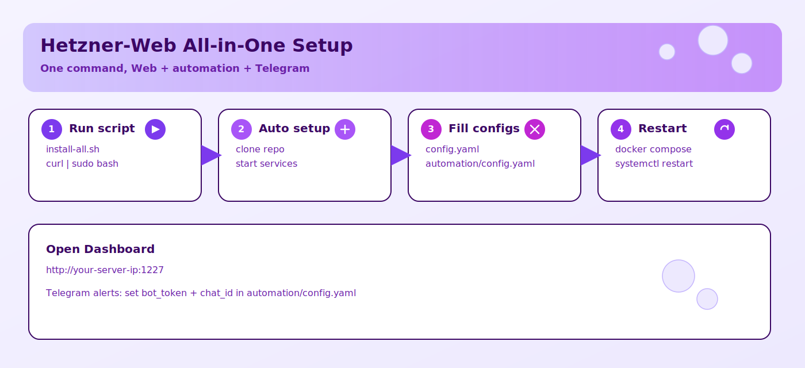
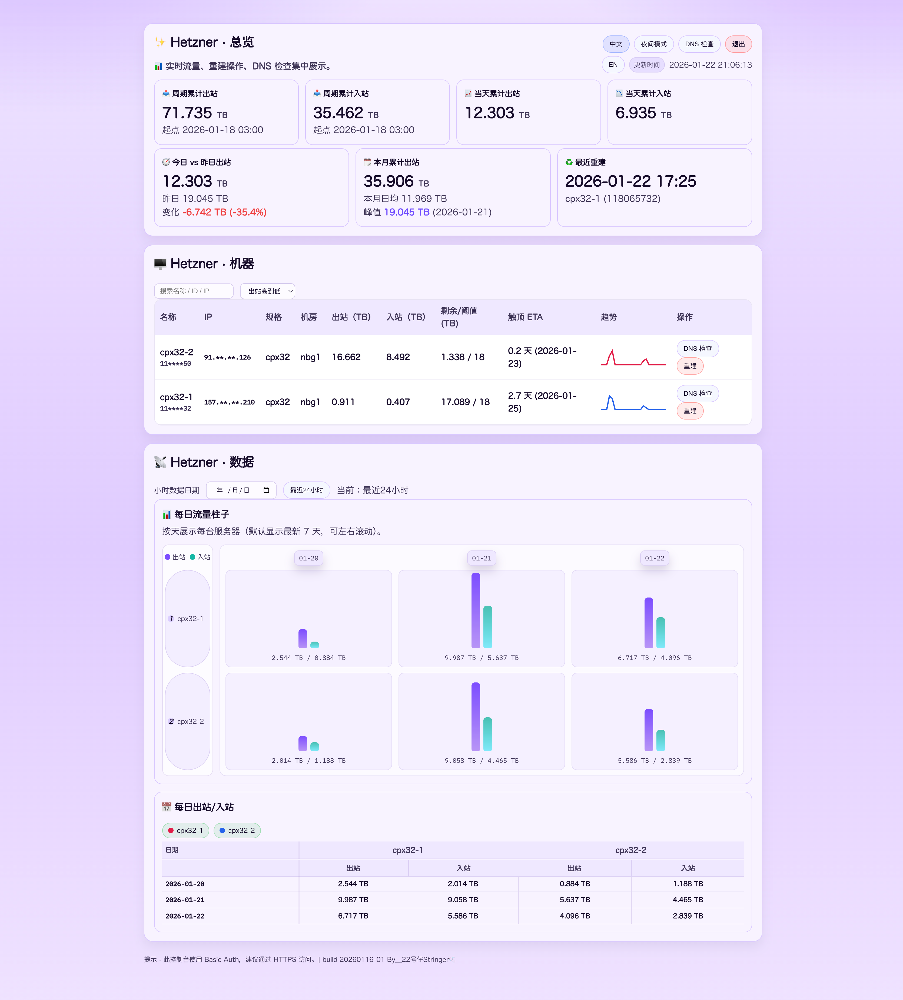
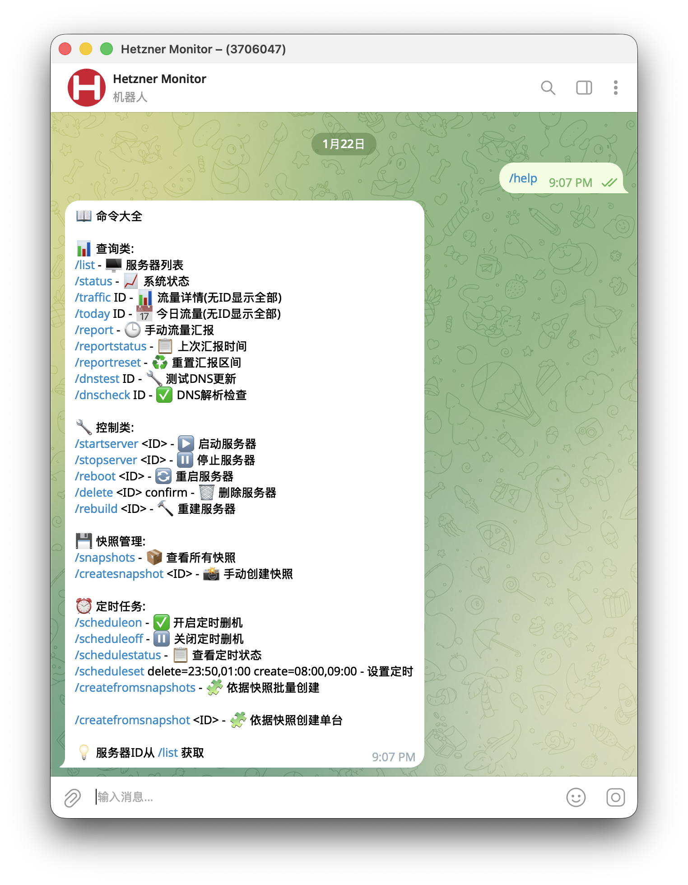
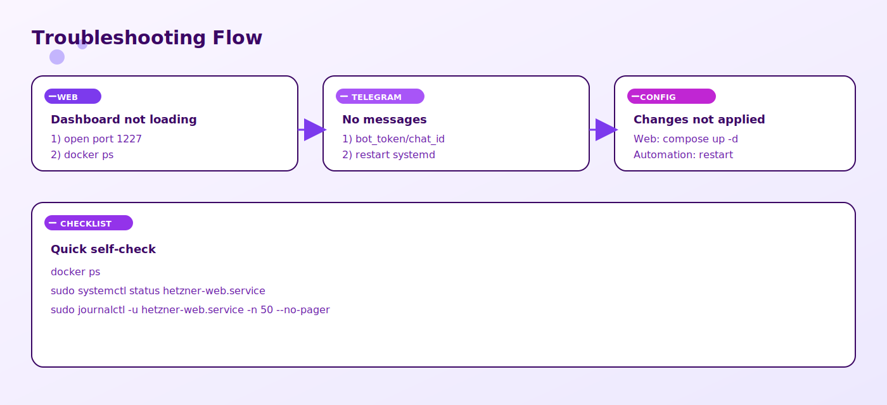
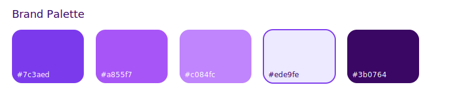

# Hetzner Web


[English](README.md) | [中文](README.zh.md)

[](LICENSE)
[](#quick-start)

A lightweight Hetzner traffic dashboard + automation monitor. Includes a web UI, Telegram alerts/commands, auto rebuilds, and DNS checks.

---

<table>
  <tr>
    <td width="60%" valign="top">
      <strong>Start here</strong><br />
      One command installs Web + automation + Telegram support.<br /><br />
      <code>curl -fsSL https://raw.githubusercontent.com/liuweiqiang0523/Hetzner-Web/main/scripts/install-all.sh | sudo bash</code>
    </td>
    <td width="40%" valign="top">
      <strong>Next step</strong><br />
      Fill configs and restart services.<br /><br />
      <code>config.yaml</code> · <code>web_config.json</code> · <code>automation/config.yaml</code>
    </td>
  </tr>
</table>

---

##  Quick Start

If this is your first time, use the all-in-one script to install Web + automation + Telegram support in one go.

```bash
curl -fsSL https://raw.githubusercontent.com/liuweiqiang0523/Hetzner-Web/main/scripts/install-all.sh | sudo bash
```

Then continue with **Config Setup** below.



---

##  Screenshots




---

##  Install Options

- All-in-one (recommended): `scripts/install-all.sh`
- Web-only: `scripts/install-docker.sh`
- Automation-only: `automation/install_hetzner_monitor.sh`

Existing deployments are safe by default. The all-in-one script exits if the install dir exists. If you really want to update an existing install:

```bash
curl -fsSL https://raw.githubusercontent.com/liuweiqiang0523/Hetzner-Web/main/scripts/install-all.sh | sudo ALLOW_UPDATE=1 bash
```

---

##  Prerequisites

Make sure these commands exist:

```bash
git --version
python3 --version
docker --version
docker compose version
systemctl --version
```

If any are missing, install them first (Ubuntu/Debian: `apt`).

---

##  Config Setup

**Web config**
- `config.yaml`: set `hetzner.api_token`
- `web_config.json`: set `username` / `password`

**Automation config**
- `automation/config.yaml`: set Hetzner/Telegram/Cloudflare if needed

Apply changes:

```bash
cd /opt/hetzner-web

docker compose up -d --build
sudo systemctl restart hetzner-monitor.service
```

Open: `http://<your-server-ip>:1227`

---

##  Telegram Setup

In `automation/config.yaml`:

```yaml
telegram:
  enabled: true
  bot_token: "YOUR_BOT_TOKEN"
  chat_id: "YOUR_CHAT_ID"
```

Then restart automation:

```bash
sudo systemctl restart hetzner-monitor.service
```

---

##  Config File Locations


- Web: `/opt/hetzner-web/config.yaml`
- Web login: `/opt/hetzner-web/web_config.json`
- Automation: `/opt/hetzner-web/automation/config.yaml`

---

##  Troubleshooting



Quick checks:
- `docker ps`
- `sudo systemctl status hetzner-monitor.service`
- `sudo journalctl -u hetzner-monitor.service -n 50 --no-pager`

---

##  Project Layout

- Web dashboard (this directory): FastAPI + Vue, Docker-first
- Automation monitor: `automation/` (CLI/systemd service)

More docs:
- Automation docs: `automation/README.md`

---

##  Features

- Real-time server traffic (outbound/inbound)
- Daily/hourly breakdown tables + per-server bars
- DNS check/sync + rebuild actions
- Telegram bot for query + control commands
- Snapshot rebuild + create from snapshot
- Scheduler for timed delete/create
- Trend sparkline per server
- Basic Auth login

---

##  Security Notes

- `config.yaml` / `web_config.json` / `automation/config.yaml` are sensitive. Do not commit them.
- Use HTTPS reverse proxy for public access.

---

## Brand


