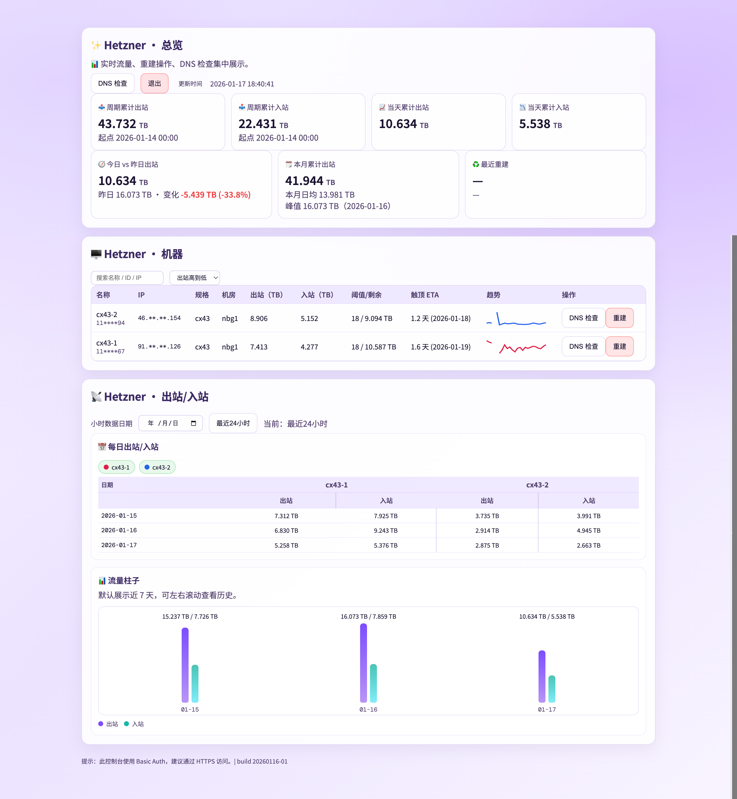

# Hetzner Web

[English](README.md) | [中文](README.zh.md)

[](LICENSE)
[](#快速开始-docker)

一个轻量的 Hetzner 流量控制台，提供日/小时视图、重建操作、DNS 检查和清晰的仪表盘。

## 关于

Hetzner Web 是面向 Hetzner Cloud 的流量可视化控制室。它把原始流量数据整理成日/小时洞察，
突出流量触顶风险，并把重建/DNS 操作放在图表旁边，方便快速处理。

## 截图



## 功能

- 实时服务器流量（出站/入站）
- 日/小时拆分表
- DNS 检查 + 重建操作
- 每台机器的趋势火花线
- 出站/入站流量柱状图
- Basic Auth 登录

## 工作方式

- 刷新时从 Hetzner Cloud API 拉取服务器与流量数据。
- 将原始数值汇总成日/小时序列，并缓存到 `report_state.json`。
- 前端为静态 Vue 面板，通过 `/api/*` 接口渲染图表。

## 技术栈

- 后端：FastAPI + Python
- 前端：Vue 3（CDN）+ 原生 JS/CSS

## 快速开始 (Docker)

```bash
cp config.example.yaml config.yaml
cp web_config.example.json web_config.json
cp report_state.example.json report_state.json
# 编辑 config.yaml + web_config.json

docker compose up -d --build
```

打开：`http://<server-ip>:1227`

## 反向代理 (Nginx 示例)

```nginx
server {
  listen 443 ssl;
  server_name hz.example.com;

  ssl_certificate /path/to/fullchain.pem;
  ssl_certificate_key /path/to/privkey.pem;

  location / {
    proxy_pass http://127.0.0.1:1227;
    proxy_set_header Host $host;
    proxy_set_header X-Real-IP $remote_addr;
    proxy_set_header X-Forwarded-For $proxy_add_x_forwarded_for;
    proxy_set_header X-Forwarded-Proto $scheme;
  }
}
```

## 配置

### `config.yaml`
- `hetzner.api_token`: Hetzner Cloud API token
- `traffic.limit_gb`: 流量上限 (GB)
- `cloudflare.record_map`: server_id -> DNS 记录
- `rebuild.snapshot_id_map`: server_id -> snapshot_id

### `web_config.json`
- `username` / `password`: Basic Auth 凭据
- `tracking_start`: 可选，如 `2026-01-01 00:00`

## 安全说明

- `config.yaml` 和 `web_config.json` 为敏感文件（已加入 gitignore）。
- 建议通过 HTTPS 反向代理访问。
- 可结合 IP 白名单限制访问。

## 备注

- 运行时数据存放在 `report_state.json`（已加入 gitignore）。
- `config.yaml` 和 `web_config.json` 已加入 gitignore，避免泄露。

## 许可证

MIT
